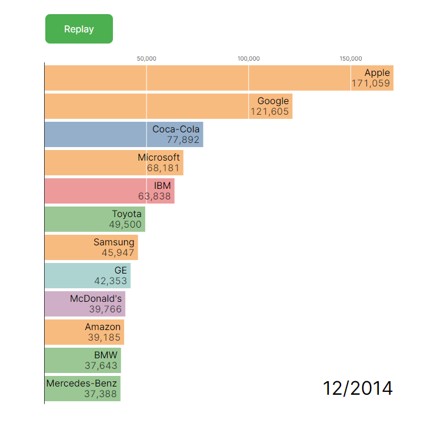

# Bar Chart Race in Vue

## Overview

This project is a study on creating a dynamic Bar Chart Race using Vue.js and D3. Created based on Mike Bostock's work. https://observablehq.com/@d3/bar-chart-race

## preview



## Demo

[Link to live demo](https://leocesar0.github.io/vue-bar-chart-race/)

## Features

- Dynamic and animated bar chart race
- Data-driven with real-time updates
- Responsive design for different screen sizes
- Easy to customize with different datasets
- Built with Vue.js for reactive components
- D3

## Installation

To get a local copy of the project up and running, follow these simple steps.

### Prerequisites

Ensure you have the following installed:

- Node.js
- npm (Node Package Manager)

### Steps to run locally

```bash
git clone https://github.com/your-username/bar-chart-race-vue.git
```

```bash
cd bar-chart-race-vue
```

```bash
npm install
```

```bash
npm run dev
```
